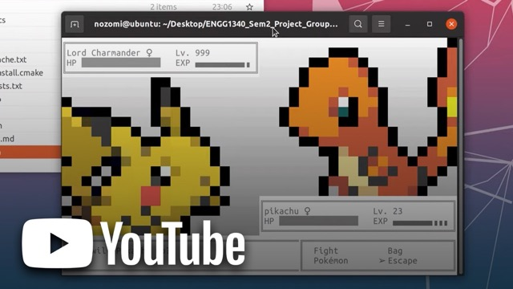
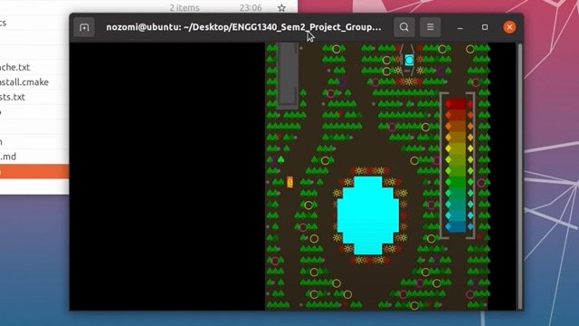
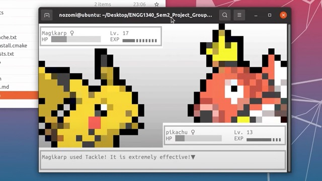
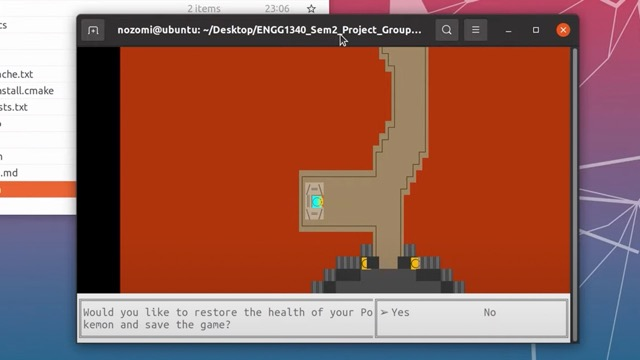
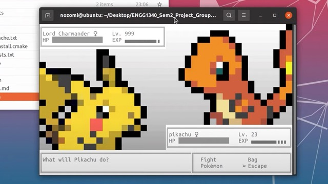

# Termimon

<a href="https://www.youtube.com/watch?v=9Nd86T34248">
    
</a>

[Demo Video](https://www.youtube.com/watch?v=9Nd86T34248)

A text-based Pokemon replica game runnable on Linux/Mac terminal. It was originally built for a C++ course at my
university.

---

## Gameplay

- It is a 2D god-view game in which the player can walk around freely with keys on the keyboard.
- Pokemons can be fought once encountered, or escaped from as the player desires.
- Players can upgrade their Pokemons by fighting others
- Game progress can be saved at checkpoints
- There are 3 scenes. As the game progresses, the enemies become harder to fight.

## Features

### Beautiful "ASCII-based" Graphics

- The player and the map are rendered as a 2D god-view, as the player walks around and interacts with objects on the
  map.
- Once a battle has started, the player's Pokemon and the enemy are rendered as cute sprites.
- All graphics are drawn pixelated beautifully as terminal characters inside the terminal.

### Dynamic Dialogue System

- The dialogue system features a polymorphism design.
- The game’s dialogue system is based on a massive node network. It is stored in an external file which is loaded once
  the game starts.

### Gameplay system

- There is a turn-based battle system for a Pokemon fight.
- Actual damage dealt with by the enemies is dynamic and will be affected by a random percentage (about 1-5%).

### Inventory System

- Pokeballs that are used to capture Pokemons can be stored inside the inventory system.
- Attributes such as health, damage and experience points (XP) will be stored individually for each Pokemon.

### Game Saving/Loading System

- Game progress including the player’s location on the map and Pokemon attributes, such as health and XP, are saved
  into an external `.json` file.
- Player's progress is saved automatically once the Pokemon were healed.

## Instructions

1. Install CMake and C++ build tools (make, g++, etc)
2. Clone this repository
3. Compile with the following commands

```
cmake . 
make
```

4. Start the game

```
./pokemon
```

## Controls

- Navigating within the map using `W, A, S, D`.
- Interacting with different game events (e.g. game characters and savepoint) using `Space`
- Choosing different dialogues or attacks using `arrow keys`
- Confirm your choices using `Enter`

## Screenshots




